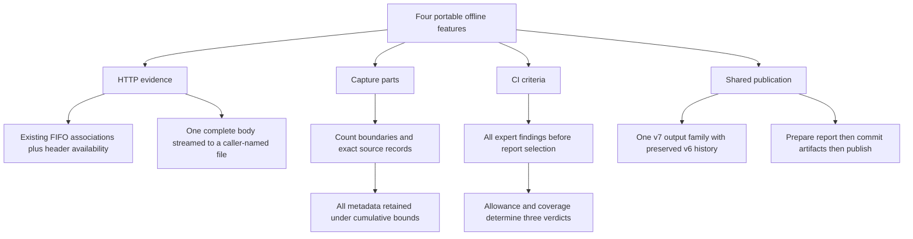

# Offline investigation: four evidence-preserving features

Status: ready-for-agent
Baseline: `dac00f33` (2026-09-27 checkout)
Scope: specification only in this session; implementation is not authorized.

The user requested 3–6 mid-sized features and implementation-ready tickets,
then selected the recommended offline direction and delegated feature and
architecture decisions. This batch contains four user-facing features and ten
implementation tickets. Every product and architecture branch below is settled.

## Outcome and scope

| Feature | User outcome | Size | Authoritative behavior |
| --- | --- | --- | --- |
| HTTP transactions | Inspect request/response header associations and capture-observed waits, including unanswered and orphan observations | Medium | [HTTP transaction spec](../http-transactions/spec.md) |
| HTTP body export | Save one completed message body, byte-exact after chunk removal, without buffering it in memory | Medium | [HTTP body export spec](../http-body-export/spec.md) |
| Capture splitting | Divide a capture into bounded physical-frame parts without discarding source metadata | Medium–large | [Capture split spec](../capture-split/spec.md) |
| Expert CI gates | Turn completed expert findings into reproducible pass/fail/inconclusive automation results | Small–medium | [Expert gate spec](../expert-ci-gates/spec.md) |

These are offline capabilities in every feature profile. Existing DNS
correlation, HTTP header parsing, capture merging, dependency-preserving export,
endpoint statistics, `stats --table io`, and checksum findings are already
implemented and are not new work in this batch. Packet construction, live
providers, network policy, new protocols, HTTP/2, TLS decryption, content
decompression, and capture-time-based splitting are outside this batch.

## Decisions and ownership

| Decision | Selected design | Reason |
| --- | --- | --- |
| Feature count | Four connected offline features | Portable fixtures can prove both value and failure behavior |
| Runtime ownership | Pure parsing, correlation, gate evaluation, and splitting in core; file staging, arguments, output, and process status in CLI | Existing directional crate boundaries and ADRs 0001–0003 |
| HTTP correlation | Extend the existing FIFO queue; opt in with `--transactions` | One authority for `Message.request` and transaction association |
| HTTP time | Physical-frame parser-availability markers and signed intervals | Reassembly provenance cannot identify exact per-octet capture times |
| Body export | One explicit invocation-local message index and one caller-named file | Bounded memory, one file handle, no capture-controlled paths |
| Split identity | Same-format raw records; all source metadata in every part | Preserve unknown metadata and interface context |
| Split boundaries | Required positive physical-frame count only | Missing timestamps and clock regressions remain faithful |
| File publication | Stage, validate, finish compression, sync, then no-clobber publication | Existing artifact conventions; explicit multi-file rollback semantics |
| Gate selection | Severity threshold plus finding allowance and minimum frame coverage; report selectors are independent | Hidden or omitted detail cannot produce a false pass |
| Machine compatibility | One `packetcraftr.output/v7` family for the batch | New command/event vocabulary and verdict semantics cross v6's strict boundary |

The [glossary](../../CONTEXT.md), [HTTP evidence ADR](../../docs/adr/0005-http-artifacts-and-timing-preserve-observed-evidence.md),
and [capture metadata ADR](../../docs/adr/0006-capture-parts-retain-all-source-metadata.md)
record the new domain language and consequential trade-offs. The current
instruction authorizes these documents, not execution of their tickets.

The design tree is closed at every branch:

## Ticket order

Each row links the complete ticket. Dependencies are ticket IDs, not implicit
ordering. After BASE-01, independent feature branches may proceed concurrently;
HTTP-T02 precedes HTTP-B02 to serialize edits to the HTTP CLI/DTO surface.

| ID | Ticket | Depends on |
| --- | --- | --- |
| BASE-01 | [Prepare the full v7 contract and its consumers](issues/01-output-v7.md) | None |
| HTTP-T01 | [Core header transactions and timing](../http-transactions/issues/01-core-header-transactions.md) | BASE-01 |
| HTTP-T02 | [Publish HTTP transactions](../http-transactions/issues/02-cli-transactions.md) | HTTP-T01 |
| HTTP-B01 | [Stream selected body bytes from core](../http-body-export/issues/01-core-body-sink.md) | HTTP-T01 |
| HTTP-B02 | [Publish a body artifact](../http-body-export/issues/02-cli-body-artifact.md) | HTTP-B01, HTTP-T02 |
| SPLIT-01 | [Core faithful bounded splitting](../capture-split/issues/01-core-split.md) | BASE-01 |
| SPLIT-02 | [Stage and publish capture parts](../capture-split/issues/02-cli-split.md) | SPLIT-01 |
| GATE-01 | [Core analysis gate](../expert-ci-gates/issues/01-core-gate.md) | BASE-01 |
| GATE-02 | [Expert gate options, reports, and exit status](../expert-ci-gates/issues/02-cli-gate.md) | GATE-01 |
| BASE-02 | [Prove and document the complete batch](issues/02-batch-conformance.md) | HTTP-T02, HTTP-B02, SPLIT-02, GATE-02 |

## Shared implementation contract

- Follow repository `AGENTS.md`; agent-created branches use `tyk/`.
- No netio or live-workflow changes are needed. No new unsafe code, runtime,
  worker pool, dependency, or network access is part of the design.
- Use self-named modules, keep assembly private, and expose each capability
  through one public path. Proposed API names in the feature specs are binding.
- CLI output types own every published field and convert library values via
  `From`/`TryFrom`; a library serde derive is not an output contract.
- Physical input ceilings include skipped frames. Existing deadline,
  cancellation, decompression, interface, provenance, reassembly, and output
  ceilings remain effective. A blocking stdin read remains synchronous.
- Preserve typed error sources. Execution failures retain classified error
  output; only a successfully published gate verdict can produce exit 1.
- Existing `--resource-preset` explicit-override precedence remains unchanged.
  New bounds are declared through `Spec::resources`; new preset values are
  explicitly listed in the feature specs, with no changes to frozen existing
  `ci-v1`/`workstation-v1` values.
- Core public regressions use `*_contracts.rs`; schema assertions use
  `*_conformance.rs`; helpers follow `CONTEXT.md`. Test behavior and meaningful
  failures, not file layout or duplicated implementation arithmetic.
- All examples and fixtures use documentation addresses and synthetic bytes.
  Tests require no external traffic, production captures, or privileged I/O.

The v6 schema and frozen v6 forwarding fixture remain byte-identical. Add the
complete final v7 schema in BASE-01; feature tickets implement its specified
variants. This is one unreleased batch: BASE-02 is required before release.
Packet/v2 and rewrite/v1–v2 are unchanged. Library API additions and the
HTTP collector's new event/lifetime surface are documented in Unreleased.

### Prepare artifact reports before publication

BASE-01 adds these private CLI seams, shared by HTTP-B02 and SPLIT-02:

- `StreamEncoder::prepare_complete(result, diagnostics)` returns an opaque
  crate-private, non-Clone `PreparedComplete`. Under the existing output lock, check the
  encoder is open; capture its identity, sequence, command, diagnostics, and
  one resource snapshot; build the actual complete envelope and serialize the
  newline-ended record under `MAX_RECORD_BYTES` (16 MiB). Release the lock.
  Check the invocation deadline before and after serialization. Preparation
  emits nothing, advances no sequence, and leaves the stream open.
- `StreamEncoder::publish_prepared_complete(prepared)` verifies the same
  shared encoder (Arc identity; clones count as the same encoder) and unchanged
  sequence/open state, consumes the token, then uses the normal deadline,
  bounded writer, flush, and terminal-state machinery with the prepared bytes.
  It neither serializes again nor resamples resources. A wrong encoder/stale
  sequence is typed `internal.prepared_output`/Internal/70. Dropping a prepared
  completion has no effect; a commit failure can still emit the usual error
  at the current sequence. No other event is emitted between prepare/publish
  in the two artifact commands.
- `rendering::machine::prepare_aggregate` creates a crate-private
  `PreparedAggregate<T>` owning the fully decorated success envelope. Preflight
  the deterministic owned DTO with the existing pretty-JSON counting writer
  (`usize::MAX` overflow ceiling, no second payload buffer); `publish(self)`
  sends that same frozen envelope through `emit_json`. Aggregate JSON has no
  global 16 MiB record limit: its result allocations remain bounded by the
  feature's existing item/application limits. The 16 MiB rule is NDJSON-only.

These helpers perform no file commits. Resource diagnostics in these artifact
reports are sampled immediately before commit. File commits can still fail;
only then is the prepared success discarded. After commit, deadline or stdout
failure may prevent reporting, but already-published artifacts remain. Text
requires all fallible DTO conversions and body-metadata budget charging before
commit; its output writes occur after commit and can fail normally. Existing
non-artifact commands keep their current rendering entry points.

## Design stress tests and closed branches

| Adversarial case | Required answer |
| --- | --- |
| A response starts before an upload finishes | Pair parsed headers; do not wait for a complete request body |
| IP fragments and TCP gap filling release old bytes | Marker uses the frame that made bytes available; source sets remain provenance |
| Clock goes backwards | Retain a negative signed interval; never clamp, reorder, or infer synchronization |
| Header is paired but body later fails | Keep header association and explicit message failure as separate evidence |
| Body names `../../secret` in a header | Only the caller's `--write` determines the destination |
| Content is gzip-encoded or has another transfer coding | Export unchanged coded bytes after chunk removal; no decompression |
| Body completes, later capture parsing fails | No artifact is published |
| Split input has unknown options or metadata after its last packet | Every part retains those validated source records |
| Metadata duplication expands a tiny packet selection | Exact decoded-output preflight plus encoded-output ceiling; fail before publication |
| Many parts exhaust file descriptors | Close each sealed staged file; retain bounded closed handles |
| One destination appears during publication | No overwrite; roll back this invocation's earlier publications, report cleanup failures |
| A warning is hidden by `--min-severity error` | The gate still sees it if its own threshold includes warnings |
| Findings are omitted from aggregate detail | Complete gate counts still determine the verdict |
| No frame matches the capture filter | Enabled gate is inconclusive unless existing EOF findings already exceed its allowance |
| Budget or output sink fails | Classified execution failure, never a gate pass or completed report |

No open architecture decisions or deferred product questions remain. A future
implementer must report an actual contradiction with this baseline instead of
silently changing the contract or substituting a different feature.

## Completion evidence

BASE-02 records exact command results and unavailable environments. The spec
session itself validates document links, dependency completeness, and
consistency against source; it does not run or claim implementation tests.
Feature specs contain numbered acceptance cases; each ticket identifies the
cases it owns and the exact test targets. The complete batch must satisfy every
case, all current conformance tests, the portable profile, and the comprehensive
Linux check from `AGENTS.md`.

## Comments

- User direction: “leave a spec. don't execute the spec,” then “i choose
  recomended” in response to offline investigation and delegated design choices.
- Read-only exploration confirmed that previous local architecture/testing
  efforts were resolved. This batch does not reopen those implementations.
- Specification review checked 18 Markdown documents, all local links, the
  ten-ticket dependency graph, 65 unique acceptance cases, and 26 distinct
  referenced test targets (existing targets or explicitly assigned additions).
  No broken links, dependency cycles, unknown targets, or whitespace errors
  remained. Rust implementation tests were not run: no implementation changed.
