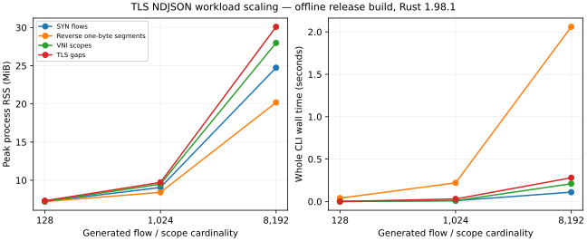

# Analysis resource and evidence contracts

Input selection occurs after capture-global IP reconstruction and conversation
indexing, and before TCP dispatch and collectors. A stream predicate such as
`tcp.stream == 7` preserves its TCP input; `tls.sni == "example.test"` drops
server and segmented-handshake frames. Select completed TLS sessions instead.
Filtered-out frames still consume physical-input, scope, and index budgets.
Pre-filter the capture file itself when those costs must be reduced.

A scoped tuple is a conversation, not a TCP connection epoch. TLS `session` is
unique per emitted handshake. Follow `direction_generation` separates delivery
state across reuse and eviction; it does not infer an unseen handshake. Scope
metadata uses the reader's capture-wide interface numbering across sections;
source-local section/interface identifiers remain on capture records. Endpoint,
port and protocol tables are capture-wide aggregates; conversation rows identify
their exact domains.

IP expiry follows every physical frame; TCP applies the same clock policy to
selected frames. Thus a filter can hide a clock jump from TCP while it remains
in the capture-global clock report. Capture time drives expiry in capture order,
across interfaces. The first
physical timestamp anchors the clock; subsequent offsets advance a high-water
mark. A rollback cannot rewind it. A forward outlier can expire state immediately
and pin expiry until later timestamps catch up. Clock reports include filtered
input, rollback counts/magnitudes and the largest forward step with its frame.
A forward step is evidence, not an assertion that a legitimate capture gap is
malformed. Out-of-range instants fail with a typed timestamp error. I/O buckets
use their separately reported first-observed matched `origin`; earlier timestamps
are counted in `underflow_frames` and folded into bucket zero.

## What the ceilings cover

| Retention | Bound and lifetime |
| --- | --- |
| Physical input | `max_frames` and `max_bytes` count all physical frames/payload bytes, including filtered frames. Reader block/frame and interface limits apply separately. |
| Conversation indices | At most `max_flows` distinct scoped tuples **per transport** over the entire capture. Payload expiry does not remove these keys. TLS's distinct-observation set is bounded by the same IDs. |
| Scope paths | `max_scope_bytes` charges both retained path copies and conservative table/header capacity. Output shares immutable paths. Count is also bounded from the physical frame ceiling. This is a retained metadata charge, not allocator accounting. |
| IP state | `max_ip_reassembly_bytes` covers retained fragments, reconstruction/cascade buffers and charged metadata; per-datagram, fragment and retained-outcome limits also apply. |
| TCP state | `max_tcp_reassembly_bytes` covers retained payload/history and charged flow/segment metadata. Per-direction byte/segment ceilings and capture-time idle expiry are independent. |
| TLS state | `max_tls_sessions` bounds live/closed tracking slots; `max_tls_buffer_bytes` bounds handshake/alert buffering. A direction has a 135,168-byte buffer ceiling. Terminal paths release recorded charges. |
| Stats | Only the selected table allocates aggregation entries in the CLI. Library `Table::All` intentionally retains all tables. `--top` caps final rows, not keys needed to compute exact counts. |
| Results | JSON retains selected rows/sessions/chunks according to command limits. TLS output retention is independent of active state. NDJSON holds one prepared line per encoder, at most 16 MiB including newline. |
| Native/progress work | Offline analysis uses no native capture queue. Live capture can additionally retain its bounded native queue. A blocked output/callback worker retains its permit and captures until cleanup actually ends. `Runtime::snapshot()` exposes active, rejected, and timed-out retained capacity. |

A useful peak estimate is **input/decode + indexed metadata + IP + TCP + TLS +
selected collector + retained results + serialization + runtime/native overhead**,
including only the stages that the command enables. At default TLS settings the
four principal state charges alone can total 400 MiB: TCP 256, IP 64, TLS 64 and
scope 16. This is neither a reservation nor an RSS cap. Index tables, decoded
layers, result ownership, thread stacks, allocator overhead and transient copies
coexist. For a frame of B bytes, a hex output field alone needs about 2B string
bytes before bounded NDJSON serialization begins. Raising JSON retention can
increase memory even while active TLS state stays fixed.

No global allocator framework or process-RSS promise is introduced. The encoder
prepares records atomically, but an OS writer can still fail halfway through
`write_all` or at flush. It then fails closed and never acknowledges completion.
Max-duration NDJSON commands also bind an encoder publisher to their remaining
operation duration. Lock polling is cooperative (1 ms); serialization is checked
on return, and writer waiting is clipped to the smaller remaining duration and
per-write timeout. The original encoder owner can attempt a terminal error under
its separate one-second CLI writer-wait budget. Direct arbitrary `Write` implementations are
not preemptible. Capture/exchange response windows are not output deadlines.
A caller's workflow deadline bounds its wait for callbacks; the callback itself,
serialization and its destructor may finish later. Generic `Read` and providers
must return before their next cooperative check. Capture polling and cancellable
pacing check at intervals of at most 25 ms while scheduled, excluding provider
overshoot and scheduler delays.

## Reproducing measurements

Run `scripts/measure-memory.sh --sizes 128 1024 8192` for release-profile CLI
measurements. It generates unique flows, tiny reverse-ordered TCP segments,
retransmissions, reverse fragments, VNI scopes and TLS gaps, and measures read,
follow, TLS, selected/filtered stats, file/pipe input and intentional limit
failures. `target/analysis-measurements/report.json` records exact commands,
binary digest, compiler, feature profile, workload size, physical frame count,
input bytes, exit codes, time and peak RSS. Per-command help files preserve the
effective defaults. Setup is outside the timed child; process startup and output
to `/dev/null` are inside. `read` supports NDJSON, not aggregate JSON; TLS and
stats exercise aggregate output where supported.

Use `--heaptrack` for **separate** allocator-profile runs, or run a focused
`heaptrack -o PROFILE target/release/packetcraftr ...` and inspect it with
`heaptrack_print -f PROFILE.zst`. RSS measurements exclude profiler overhead.
Allocator “unfreed at exit” includes process-lifetime state and is not proof of
an operation leak; engine and callback cleanup tests check their own ownership.
Do not interpret a process that has exited as an in-process heap-retention sample.
Shared-runner timings are observations, not performance gates. Keep full report
files with the binary digest when comparing versions.

A checked-in [measurement snapshot](analysis-measurements.json) records 56 runs
at cardinalities 128, 1,024 and 8,192. Six intentionally tight flow/scope limits
returned policy errors; the other 50 runs completed. These are single shared-
container observations, with 0.01-second wall-time resolution. In this snapshot,
TLS NDJSON peaked at about 30.1 MiB for 8,192 gapped handshakes; this is a measured
workload point, not an upper bound for other captures or larger limits.

The [allocation comparison](stats-allocation-comparison.json) records the two
binary digests and the command used for the protocol-name lookup experiment.

The September 7 local measurement of 8,192 unique flows with protocols-only
stats recorded 191,355 allocator calls before borrowed protocol-name lookup and
174,973 after it (16,382 fewer; output byte-identical). Heaptrack measured about
1.58 MB peak heap before the lookup change. Decoder/layout allocation remained a
larger contributor, so no hasher, unsafe storage, or decoder rewrite followed.

## Interpreting loss and empty results

| Evidence | Interpretation |
| --- | --- |
| `sessions == 0`, completed invocation | No assembled TLS was observed; inspect `tcp_streams` and `udp_443_frames`. |
| `sessions > 0`, `sessions_selected == 0` | Session selectors excluded the assembled sessions. |
| `sessions_evicted` / `buffer_limit_hits` | Analysis lost active state to a resource ceiling; session statuses preserve domain evidence. |
| `sessions_omitted` / omission diagnostics | Analysis ran, but aggregate output retention excluded results. |
| IP incomplete/eviction counters and omitted outcomes | Capture-global fragment evidence, independent of presentation filtering. |
| Terminal `error` / `io.output_record_limit` / `io.cancelled` | Invocation is incomplete. Earlier records remain useful but are not a complete answer. |
| Partial bytes with no terminal record | Output is incomplete; do not infer success from a process or schema-valid prefix. |

The configured CLI flags and typed library errors identify the corresponding
ceilings; these existing counters/codes remain the canonical evidence rather
than a second generic loss taxonomy.
