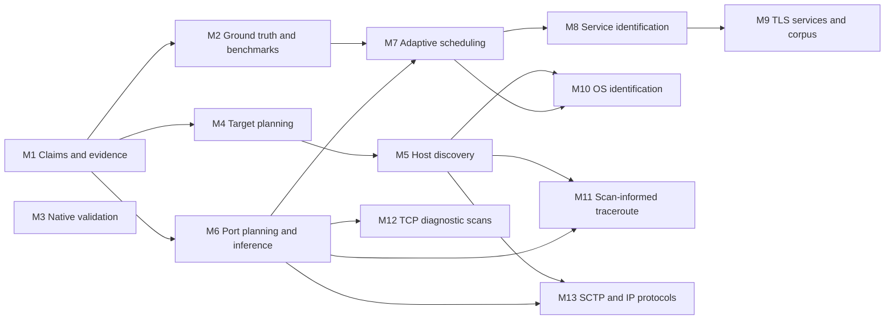

# Core scanner roadmap

This roadmap addresses PacketcraftR's core scanner gaps relative to Nmap for
**authorized network inventory and diagnostics**. It complements PacketcraftR's
packet-development and offline-analysis role; it does not propose cloning the
entire Nmap tool suite.

It is milestone-driven: each milestone has a fixed scope, invariants, decisions
to settle, and exit criteria, but no date. A milestone closes when its exit
criteria pass. The milestones are **planned work, not shipped capabilities or
release commitments**.

| Document | Purpose |
| --- | --- |
| [Nmap gap matrix][matrix] | Each compared Nmap capability, PacketcraftR's state at the reviewed baseline, and the workstream that closes the gap |
| [M1][m1] through [M13][m13] | One specification per milestone, listed [below](#milestones) |

## Comparison baseline

The implementation baseline is `main` at `22c7d182d577`, reviewed on
2026-10-05, rather than only the published `0.5.0-beta.3` release. In particular,
that baseline publishes [output v6][output-contract], [M4][m4] moved `main` to
v7, and the beta release has different contracts. Review the [release and
migration guidance][project-readme] before assuming a roadmap baseline applies
to a released binary.

The comparison uses the [official Nmap reference guide][nmap-guide] consulted on
2026-10-05. The [download page][nmap-download] identifies `7.991` as stable at
that date, while the online options summary can describe a development version.
Future comparison runs must record the actual Nmap version and build features,
not infer them from the moving online guide. Database-size and throughput claims
from the guide are not acceptance targets.

PacketcraftR already has bounded IPv4/IPv6 target selection, TCP SYN and ordinary
TCP connect scanning, UDP and ICMP echo probes, per-port UDP response checks,
UDP/TCP/ICMP traceroute, and versioned JSON/NDJSON evidence. The main gaps are
composed host discovery, scanner-oriented port selection and inference,
adaptive scheduling, active service/version and OS identification, and broader
diagnostic scan modes. Existing packet codecs or passive TLS fingerprints do
not by themselves fill those workflow gaps.

## Scope and non-goals

Committed roadmap priorities are:

1. Target planning, host discovery, and trustworthy mainstream scanning
   ([M4][m4] through [M6][m6]).
2. Service/version and OS identification with explicit evidence and confidence
   ([M8][m8] through [M10][m10]).
3. Bounded performance improvements ([M7][m7]) and equal Linux, macOS, and
   Windows acceptance requirements throughout ([M3][m3]).
4. Later diagnostic coverage for scan-informed traceroute, additional TCP scan
   families, SCTP, and IP-protocol inventory ([M11][m11] through [M13][m13]).

Scripting/NSE, scan resume/checkpointing, and Nmap-compatible XML are deferred.
Exact Nmap CLI syntax, legacy output formats, and Zenmap/Ncat/Nping/Ndiff clones
are not parity goals. Evasion/decoy, idle/bounce, exploit/brute-force, unbounded
scanning, and random public-target workflows are outside this roadmap. These
are scope decisions, not claims that their Nmap equivalents do not exist. The
[gap matrix][matrix-deferred] records each one.

Capability parity means comparable, documented outcomes on the declared fixture
and platform matrix, not identical algorithms, defaults, flags, or database
coverage. No milestone should be marked complete merely because a new option
exists or one Linux fixture agrees with Nmap.

## Invariants and ownership

All milestones retain the [repository guide][repository-guide] boundaries:

- Authorize declared targets, resolution, and the operation before active
  discovery; check final numeric endpoints and materialized bytes before
  transmission. Discovery, identification, retries, and traceroute all spend
  explicit finite budgets.
- Preserve captured bytes, scope, timestamps, per-attempt outcomes, and partial
  execution evidence. Silence is an observation, not proof that a host is absent
  or a UDP port is closed. A gateway's neighbor reply is not a remote host reply.
- Keep host reachability, inferred port state, application observations, and
  execution/capability failures distinct. Do not turn a missing backend into a
  network timeout or an untrusted banner into authenticated identity.
- Follow the [consumer compatibility policy][compatibility]. New enum meanings
  or incompatible inference semantics require a new contract family; schemas,
  examples, CLI conformance tests, migration notes, and release assets move
  together when future implementation changes contracts. This roadmap itself
  changes none of them.

| Owner | Responsibility in this roadmap |
| --- | --- |
| `packetcraftr-core` | Portable packet models/codecs, bounded fingerprint documents and parsers, pure matching, and offline fixture analysis; no native I/O or live policy. |
| `packetcraftr-netio` | Socket/capture/transmit providers, native resources, cancellation and cleanup accounting, and platform capability boundaries. |
| `packetcraftr` | Discovery/scanning/identification/traceroute workflows, authorization, preparation, scheduling, budgets, and domain evidence. |
| `packetcraftr-cli` | Target/port arguments, provider composition, rendering, and versioned machine representations. |

Only netio's `platform/` owns unsafe code. Native selection remains in its
`build.rs` and dispatch boundary; code elsewhere uses emitted capability cfgs.
Expose capabilities without introducing equivalent public assembly paths.

## Milestones

Milestones are numbered in recommended order. The dependency graph is the
binding constraint: milestones without a path between them may proceed in
parallel. OS identification, for example, need not wait for service
identification.

| ID | Milestone | Outcome | Depends on | Status |
| --- | --- | --- | --- | --- |
| M1 | [Claims and evidence model][m1] | Separate vocabularies for host observations, inferred port states, attempt outcomes, and operational failures; a reviewed policy for scanner data. | None | Complete |
| M2 | [Ground truth and benchmarks][m2] | A versioned comparison corpus with provisioned expected outcomes, pinned Nmap comparison runs, and repeatable workflow benchmarks. | M1 | In progress |
| M3 | [Native validation on three platforms][m3] | Controlled privileged runtime routes for macOS and Windows beside the Linux lane, reporting exercised, failed, and unavailable scenarios. | None | In progress |
| M4 | [Target planning][m4] | Bounded target/exclusion manifests, packet-free list mode, scoped IPv6 identity, and source-aware diagnostics, verified across Linux/macOS/Windows feature profiles. | M1 | Complete |
| M5 | [Host discovery][m5] | A composed discovery workflow over ARP/NDP and ICMP/TCP/UDP probes, with host-level records, reasons, and optional enrichment. | M4 | In progress |
| M6 | [Port planning and state inference][m6] | Catalog and named port selections, port exclusions, curated UDP payloads, mixed TCP/UDP plans, inferred states, and capability-aware method planning. | M1 | In progress |
| M7 | [Adaptive scheduling and bounded performance][m7] | RTT-driven timeouts, selective retries, rate-limit handling, per-host fairness, adaptive windows, and redesigned connect scheduling under hard ceilings. | M2, M6 | In progress |
| M8 | [Service and version identification][m8] | A read-only identification workflow with banner and protocol-aware probes, match documents, and separate claim/candidate/confidence records. | M7 | Planned |
| M9 | [TLS services and identification corpus][m9] | TLS-wrapped interrogation over a bounded transport, an expanded reviewed corpus, and held-out evaluation of coverage and confidence. | M8 | Planned |
| M10 | [OS identification][m10] | Finite IPv4 and IPv6 stack-fingerprint collection, matching against a reviewed corpus, and qualified or explicitly inconclusive results. | M5, M7 | Planned |
| M11 | [Scan-informed traceroute][m11] | Traceroute that selects an observed responsive probe, traces several authorized hosts under one plan, and reuses paths with explicit provenance. | M5, M6 | Planned |
| M12 | [TCP diagnostic scans][m12] | ACK/window and FIN/NULL/Xmas/Maimon scan families with probe flags kept separate from inference rules. | M6 | Planned |
| M13 | [SCTP and IP-protocol inventory][m13] | SCTP INIT/COOKIE-ECHO scanning, typed IP-protocol inventory, and the remaining discovery probe families. | M5, M6 | Planned |



### Close gates

The graph shows what a milestone needs before it can start. Two milestones
additionally gate closing, and are not drawn as edges to every node:

- **Ground truth ([M2][m2]).** A milestone that publishes scanner results
  cannot close until its scenarios are in the comparison corpus with
  independent expected outcomes.
- **Runtime evidence ([M3][m3]).** A milestone with native behavior cannot
  close until that behavior has recorded runtime evidence on Linux, macOS, and
  Windows for every profile where the capability is supported.

Work on a milestone may proceed before those gates exist; it stays
`In progress`. Unsupported profiles remain explicit limitations, not a way to
call a missing platform feature complete.

## Gap gate and scorecard

The committed scope is reached when every row of the [gap matrix][matrix] is
`Present with constraints`, `Deferred`, or `Non-goal`. Progress is reported with
these measures, recomputed whenever a milestone closes:

| Measure | Definition |
| --- | --- |
| Gap coverage | Rows marked `Present with constraints`, divided by all rows not marked `Deferred` or `Non-goal`. |
| Result accuracy | Share of [M2][m2] corpus scenarios whose published outcome equals the provisioned expected outcome, per workflow and IP family. |
| Work and latency | Probes or connections sent and elapsed time for each [M2 benchmark][m2-benchmarks] scenario. |
| Retained state and memory | Charged retained-state bytes and peak process memory for each benchmark scenario, reported separately. |
| Platform evidence | Required scenarios exercised, failed, and unavailable on each of Linux, macOS, and Windows, as [M3][m3-reporting] reports them. |
| Identification quality | Held-out results for service ([M9][m9-evaluation]) and OS ([M10][m10-evaluation]) candidates, including the share reported as unknown or ambiguous. |

At the reviewed baseline the matrix has 44 rows: 9 `Present with constraints`,
13 `Partial`, 14 `Missing`, 3 `Deferred`, and 5 `Non-goal`, a gap coverage of 9
of 36 (25%). The other measures have no baseline; M2 and M3 define how they are
recorded, and no value is claimed before then.

At M4 closure on 2026-10-07, reviewed implementation
`8e010a0b9eac118aa13384f0b854111a73d47d76` has 12 present, 12 partial,
12 missing, 3 deferred, and 5 non-goal rows: 12/36 (33.3%) gap coverage.
The [M4 acceptance records](evidence/m04/README.md) recompute the other
applicable measures: all 264 corpus case-runs matched independently provisioned
outcomes, with per-case work/latency, retained-state charges, and peak process
memory recorded separately. All 20 scoped native profile executions passed
across Linux, macOS ARM/Intel, and Windows; unsupported paths are explicit
capability results. Identification quality is not applicable to M4. This closes
M4's gates while the broader M2/M3 milestones remain in progress.

## Definition of done

Every milestone, and every workstream inside it, ships with:

1. **Authorization and budgets.** Targets, resolution, and the operation are
   authorized before active work; final numeric endpoints and materialized
   bytes are checked before transmission; every new loop, retry, or collection
   spends an explicit finite budget.
2. **Evidence.** Captured bytes, scope, timestamps, per-attempt outcomes, and
   partial-execution evidence are preserved. Host reachability, inferred state,
   application observations, and execution failures use the separate
   vocabularies [M1][m1] defines.
3. **Contracts.** Machine-contract changes follow the
   [consumer compatibility policy][compatibility]: schemas, examples, CLI
   conformance tests, migration notes, and release assets move together.
4. **Tests at the right boundary.** Owner-local unit tests, public
   `*_contracts.rs` regressions, `*_matrix.rs` combinations, and
   `*_conformance.rs` wire/schema checks, as [Contributing][contributing]
   describes. Public integration modules stay in the owning crate's single
   integration binary; process-isolated native suites keep their dedicated
   launcher. Tests use loopback, documentation addresses, or isolated fixtures
   rather than uncontrolled reachable targets.
5. **Ground truth.** Scenarios are in the [M2][m2] corpus with independent
   expected outcomes and recorded divergences. Matching Nmap alone is not an
   acceptance result.
6. **Platform evidence.** Runtime evidence on Linux, macOS, and Windows is
   recorded through the [M3][m3] routes and the
   [native validation guidance][native-validation] for each relevant
   portable, default, Layer 2, pcap-free, and full-native profile. A correct
   unsupported error validates failure behavior, not feature parity.
7. **Ownership.** Types, behavior, and tests stay with the crate that owns
   them; unsafe code stays in netio's `platform/`; code elsewhere gates on
   emitted capability cfgs.
8. **Data.** Any bundled port, payload, probe, fingerprint, or vendor data has
   a provenance record under the [M1 data policy][m1-data].
9. **Documentation.** User-visible changes are recorded in `[Unreleased]`, and
   the [gap matrix][matrix] rows the work closes are updated against the exact
   reviewed revision with links to the behavior and native evidence.

The existing comprehensive Linux check is:

```sh
cargo fmt --all -- --check
cargo clippy --locked --workspace --all-targets --all-features -- -D warnings
cargo test --locked --workspace --all-features
```

It requires libpcap development support and is not a substitute for macOS or
Windows runtime validation.

## Maintaining this roadmap

- **Status.** Each milestone file carries `Planned`, `In progress`, or
  `Complete`. A change that moves a status also updates the table above and the
  affected matrix rows. Do not mark a milestone complete based on compilation,
  a skipped scenario, or a claim that has no supporting fixture or runtime
  evidence.
- **Decisions.** Each milestone lists the decisions to settle before
  implementation. Record the outcome in the milestone file, with its rationale,
  before the first implementation change lands. A listed recommendation is a
  starting position, not a decision.
- **Exit criteria.** Check a criterion only with a link to the test, fixture,
  or recorded evidence that satisfies it, and report known limits beside it.
- **Re-baselining.** When a milestone closes, update the matrix's reviewed
  revision and source links together, and record the Nmap version and build
  features of any comparison run. Keep deferrals explicit.
- **Scope changes.** Edit the milestone specification in the change that
  proposes the new scope, so the roadmap never trails the code.

This roadmap changes no scanner behavior, schema, dependency, CI configuration,
or permission policy. It does not claim a new comparison run or successful
native validation.

[matrix]: nmap-gap-matrix.md
[matrix-deferred]: nmap-gap-matrix.md#deferred-capabilities-and-deliberate-differences
[m1]: m01-claims-evidence.md
[m1-data]: m01-claims-evidence.md#m12-scanner-data-policy
[m2]: m02-ground-truth-benchmarks.md
[m2-benchmarks]: m02-ground-truth-benchmarks.md#m23-workflow-benchmarks
[m3]: m03-native-validation.md
[m3-reporting]: m03-native-validation.md#m33-evidence-reporting
[m4]: m04-target-planning.md
[m5]: m05-host-discovery.md
[m6]: m06-port-planning-inference.md
[m7]: m07-adaptive-scheduling.md
[m8]: m08-service-identification.md
[m9]: m09-tls-services-corpus.md
[m9-evaluation]: m09-tls-services-corpus.md#m94-held-out-evaluation
[m10]: m10-os-identification.md
[m10-evaluation]: m10-os-identification.md#m105-corpus-and-held-out-evaluation
[m11]: m11-scan-informed-traceroute.md
[m12]: m12-tcp-diagnostic-scans.md
[m13]: m13-sctp-ip-protocol.md
[project-readme]: ../../README.md
[repository-guide]: ../../AGENTS.md
[contributing]: ../../CONTRIBUTING.md
[compatibility]: ../consumer-compatibility.md
[native-validation]: ../native-validation.md
[output-contract]: ../../crates/packetcraftr-cli/src/output/contract.rs
[nmap-guide]: https://nmap.org/book/man.html
[nmap-download]: https://nmap.org/download.html
